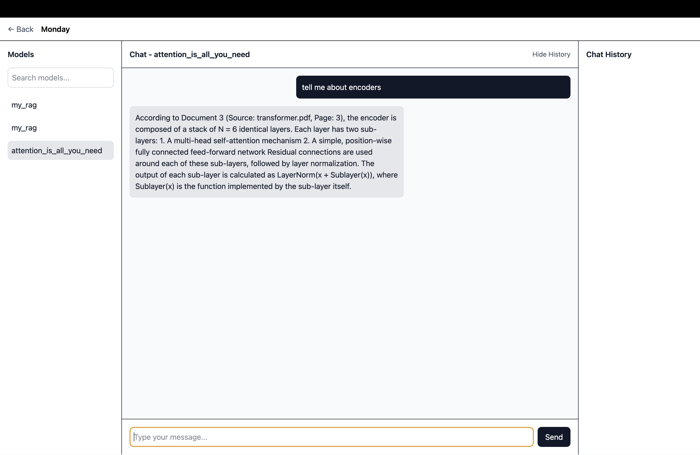
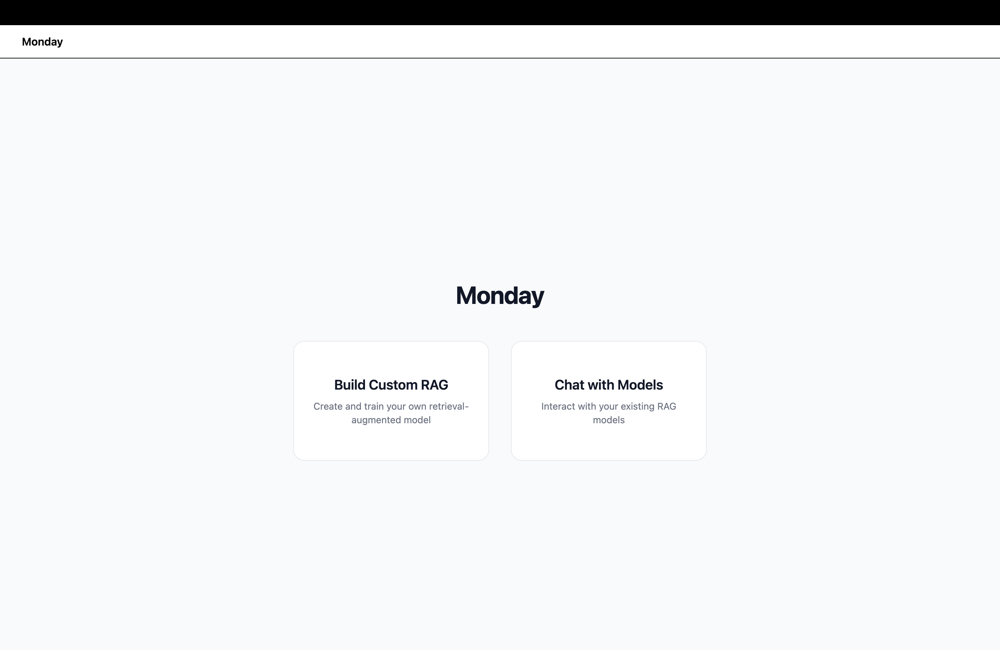
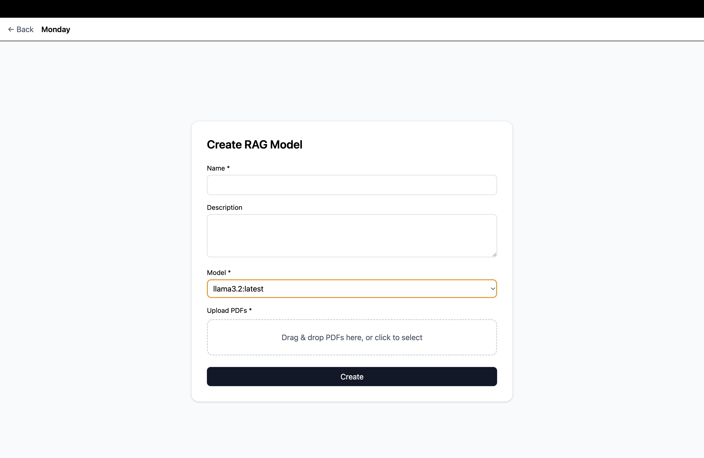

# 🚀 Monday: AI-Powered RAG Platform

Welcome to **Monday**, a modern platform for building, managing, and deploying **Retrieval-Augmented Generation (RAG)** solutions.

---

## 📌 Project Overview

**Monday** enables users to upload, index, and query documents using advanced AI models.

Users can:

* Create custom RAG models
* Choose their preferred LLM
* Attach their own knowledge base
* Reuse models anytime

This makes Monday a **flexible and scalable AI platform** for real-world applications.

---

## 📸 Screenshots

> ⚠️ Make sure these files exist in your repo with correct names and extensions

### 💬 Chat Interface

```md

```

### 🏠 Home Screen

```md

```

### 🛠️ Model Creation

```md

```

---

## 👩‍💻 For Developers

### 🧠 Backend

* Python + FastAPI
* Modular architecture
* RAG pipeline implementation
* Vector store & graph-based indexing
* Scalable service layers

### 🎨 Frontend

* React + Vite
* Electron (desktop support)
* Modern UI/UX design

### ✨ Features

* 📄 Document upload & management
* 🔍 AI-powered semantic search
* 💬 Chat with your data
* 🧠 Custom RAG model creation
* ⚡ Extensible API design

### 📂 Project Structure

```
Monday/
│── mondayBackend/   # FastAPI backend (core logic, services, models)
│── mondayClient/    # React + Electron frontend
```

---

## 💼 For Recruiters

### 🔎 What This Project Demonstrates

* Full-stack engineering (Python + React + Electron)
* AI/ML system integration (RAG, vector databases)
* Scalable backend architecture
* Clean and maintainable code design

### ⭐ Highlights

* End-to-end AI product development
* Real-world use case implementation
* Strong system design and modularity